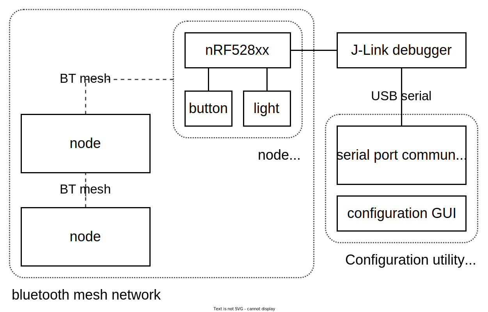
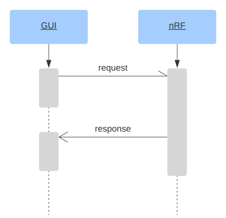

# General system architecture

Above is a diagram that shows the component layout of the end product. Notable
details are:

- The use of bluetooth mesh to establish connections between nodes in the
  network.
  
  Bluetooth mesh was chosen because it provides an abstraction layer between
  the node behaviour and low-level bluetooth protocol routines.
- The use of a J-Link debugger for connecting the border router node to a
  desktop computer running the configuration utility.
  
  The use of the J-Link debugger was chosen because it requires no additional
  USB controller setup on the node side to communicate.
  
  Because the network should continue functioning even without the
  configuration utility connected to the border router, all network
  configuration (which buttons control which lights) is stored on the border
  router. The configuration utility is only a 'viewer' for the network with
  features to edit the configuration and node state, but all action handling is
  happening on the nodes.

# Framework

The following two are the possible frameworks for this project to use:

## segger:

For this there was very little to non research before starting this project.

## Zephyr:

This can be used with either a makefile system and the correct libraries or with the highly integrated visualstudio code extension. Because of this integration making a custom makefile is too time intensive for this project and the visualstudio code extension works great already.

Further more zephyr and nordic both keep supporting their software with frequent updates and there are plenty of examples made with this.

Thus the desicion has been made to use this option.

# Data transfer between GUI and mesh network

## Asynchronous data handling

Because the data will be received asynchronously, certain decisions will have to be made about how to deal with this. In this case the GUI or client sends out requests/tasks to the border router. The border node then responds after x time. In both cases this triggers a callback function on the receiving end, so that the data can be handled accordingly, see the image below.

## Communication standards

There are two options available, each has its own set of benefits listed in the table below.

<figure>
| UART                  | Bluetooth  |
| --------------------- | ---------- |
| Less interference     | Wireless   |
| Simpler               | Complexer  |
| Available on all pc's | (opposite) | 
<figcaption>Benefits of UART vs Bluetooth</figcaption>
</figure>
Seeing that there are more pro's to using UART then Bluetooth, it makes the most sense to use UART.

# Custom serial protocol

The border router node communicates with the QT application using a USART
interface, over which our custom protocol is used to send and receive formatted
data.

The protocol itself is in a binary format to save on bandwidth and memory
consumption on the node side. The message data is derived from packed structs
(a struct of which each field is adjacent in memory, without padding). Example
binary messages with comments are provided in the source folder
`shared/protocol-tests`.

When messages are sent out by either side, they are prefixed with a single
`0xff` byte to identify the start of a message. If a message contains a literal
`0xff` byte, it will be escaped by the send function by sending the `0xff` byte
twice.

All data that is sent starts with an opcode to represent the message type, and
a message id to uniquely identify each message for the purpose of replying to a
specific message request. Most messages are fixed-length, but messages that
have variable-length fields have extra logic in the parser module to handle
memory allocation. All message types implement their own handler function which
decodes the message back into a regular struct.

The following is an example in which the server notices that the client is
connected, and the client requests a node to be provisioned into the network:

The following details should be noted in this diagram:

- Messages are numbered sequentially and independently by each side
- Each message has a separate type
- Response messages include the type of their 'parent' message
- Response messages include a status

Other important details:

- 16-bit and 32-bit numbers are sent with network (big) endianness.
- Messages are buffered until complete, so this protocol should be used over
  unbuffered serial connections only.

# Asynchronous QT Serial port

The serial data communication is done in an asynchronous manner, which allows the program to efficiently handle data that is arriving on a serial port.

## Benefits

Using an asynchronous approach allows the program to efficiently handle incoming data from the serial port, while still allowing the UI to remain responsive. This also prevents the program from having to continuously poll the serial port to check for new data. Without an asynchronous approach, this could freeze the UI and consume a lot of CPU resources. By using an asynchronous approach, the application can handle incoming data as soon as it arrives, without blocking the UI or consuming excessive CPU resources.

## Data processing

When new data arrives at the serial port, it sends out a "ready read" signal. This signal tells the Qt event loop to call the asynchronous serial data read function, which processes the data at the next available opportunity. This ensures that the data is handled efficiently and asynchronously, without blocking the UI or consuming excessive CPU resources.

# Mesh network

In mesh networking, there are a few choices made. 

## Nodes

Every node has a total of three elements which consist of one button and two lights. The software is made to make the primary element always a generic on-off client with a configuration server and a health server. Additionally, the second and third elements are only generic on-off servers. 

## Provisioning

The provisioner uses the PB-ADV instead of the PB-GATT provisioning protocol. This might change in the future depending on the beacon information and if there is enough time to switch from PB-ADV to PB-GATT.

## Semaphore

For now, there are two semaphores created in the provisioner software. The first one is created for an unprovisioned beacon signal from the provisionee. Also, the second semaphore is used for adding a node to the network. All these semaphores are to make sure there is only one signal at a time.

# Used software and library versions

<figure>
|Library|Version|
|:------|------:|
|Git|2.39.0|
|GCC|12.2.0|
|Qt|6.0.0|
|Zephyr|3.1|
|nRF SDK|2.1.2|
<figcaption>Software and library functions</figcaption>
</figure>