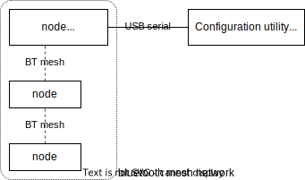
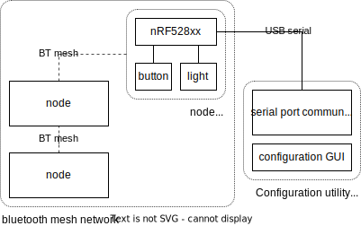
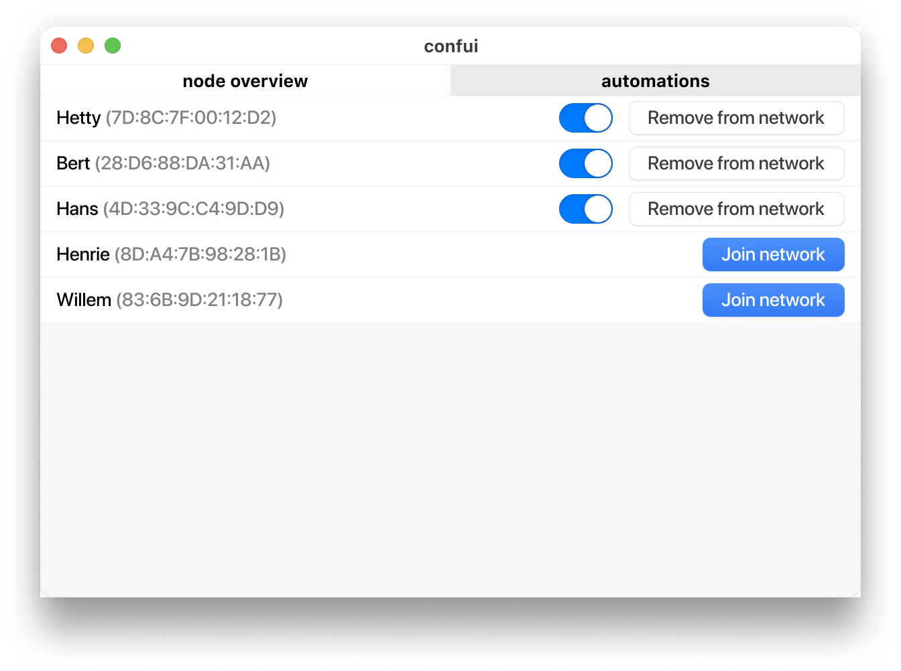
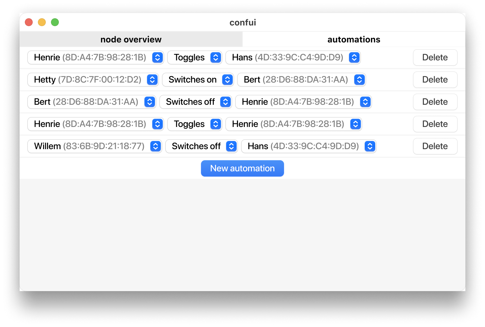
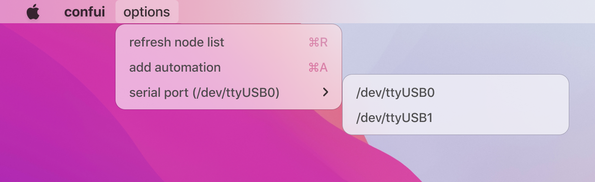
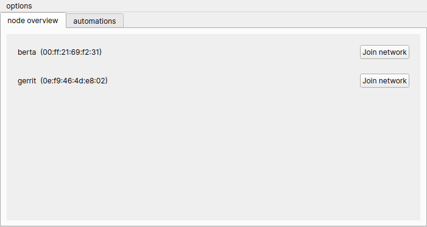
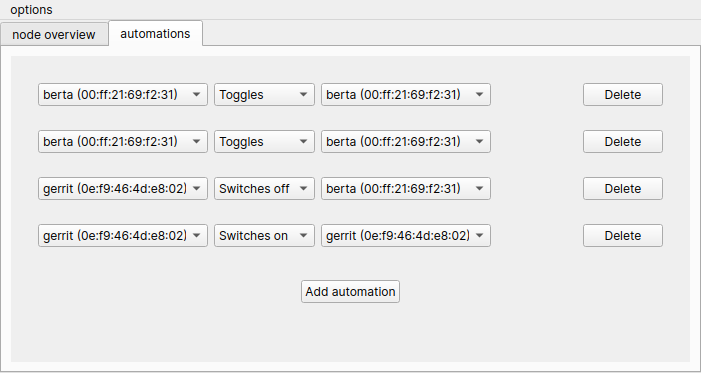
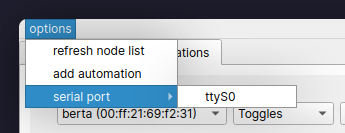

# General system architecture

Above is a diagram that shows the component layout of the end product. Notable
details are:

- The use of bluetooth mesh to establish connections between nodes in the
  network.
  
  Bluetooth mesh was chosen because it provides an abstraction layer between
  the node behaviour and low-level bluetooth protocol routines.
- Because the network should continue functioning even without the
  configuration utility connected to the border router, all network
  configuration (which buttons control which lights) is stored on the border
  router. The configuration utility is only a 'viewer' for the network with
  features to edit the configuration and node state, but all action handling is
  happening on the nodes.

## Detailed system architecture

Below is a slightly more detailed version of the system architecture:

# Framework

The following two are the possible frameworks for this project to use:

## segger:

For this there was very little to non research before starting this project.

## Zephyr:

This can be used with either a makefile system and the correct libraries or with the highly integrated visualstudio code extension. Because of this integration making a custom makefile is too time intensive for this project and the visualstudio code extension works great already.

Further more zephyr and nordic both keep supporting their software with frequent updates and there are plenty of examples made with this.

Thus the desicion has been made to use this option.

# Data transfer between GUI and mesh network

## Asynchronous data handling

Because the data will be received asynchronously, certain decisions will have to be made about how to deal with this. In this case the GUI or client sends out requests/tasks to the border router. The border node then responds after x time. In both cases this triggers a callback function on the receiving end, so that the data can be handled accordingly, see the image below.

## Communication standards

There are two options available, each has its own set of benefits listed in the table below.

<figure>
| UART                  | Bluetooth  |
| --------------------- | ---------- |
| Less interference     | Wireless   |
| Simpler               | Complexer  |
| Available on all pc's | (opposite) | 
<figcaption>Benefits of UART vs Bluetooth</figcaption>
</figure>
Seeing that there are more pro's to using UART then Bluetooth, it makes the most sense to use UART.

# Custom serial protocol

The border router node communicates with the QT application using a USART
interface, over which our custom protocol is used to send and receive formatted
data.

The protocol itself is in a binary format to save on bandwidth and memory
consumption on the node side. The message data is derived from packed structs
(a struct of which each field is adjacent in memory, without padding). Example
binary messages with comments are provided in the source folder
`shared/protocol-tests`.

When messages are sent out by either side, they are prefixed with a single
`0xff` byte to identify the start of a message. If a message contains a literal
`0xff` byte, it will be escaped by sending the `0xff` byte twice. When the
parser is done receiving a message, it goes into "idle mode". In this mode, all
data is ignored (including double `0xff` bytes), until a single `0xff` byte
followed by any other byte is received, which will cause the parser to parse
incoming data normally again. This approach of a "idle" and "normal" mode was
chosen to make the parser more resilient to serial noise.

All data that is sent starts with an opcode to represent the message type, and
a message id to uniquely identify each message for the purpose of replying to a
specific message request. Most messages are fixed-length, but messages that
have variable-length fields have extra logic in the parser module to handle
memory allocation. All message types implement their own handler function which
decodes the message back into a regular struct.

The following is an example in which the server notices that the client is
connected, and the client requests a node to be provisioned into the network:

The following details should be noted in this diagram:

- Messages are numbered sequentially and independently by each side
- Each message has a separate type
- Response messages include the type of their 'parent' message
- Response messages include a status

Other important details:

- 16-bit and 32-bit numbers are sent with network (big) endianness.
- Messages are buffered until complete, so this protocol should be used over
  unbuffered serial connections only.

A complete list of commands and the additional data they send is located in the
`shared/protocol.h` source file, and is well documented using Doxygen comments.
The protocol implementation is written in portable C, and is used by both the
client and server side to send and receive data.

# QT GUI

## UI/UX layout

The current layout implemented in the QT GUI was chosen based on the following
criteria during a brainstorming session:

- The complete network state should be visible at a glance
- Less information based on a specific context is good
- More abstraction from the actual network functionality is good

The ideas that were considered during the brainstorming sessions were:

1. A two column layout, with each list containing nodes. The right list is
   contextual, and shows the light(s) that the node selected in the left column
   is currently controlling.
   
   This idea was scrapped because it scales poorly in networks with a high
   number of nodes, and because it hides a lot of information due to a context
   specific list.
2. A node editor layout, like the shader editor found in blender (see figure
   below). Node buttons/lights can be connected with wires or lines, and nodes
   can be grouped visually into clusters.
   
   
   
   This idea was scrapped due to significant implementation complexity.
3. A layout with two tabs, (1) for managing node state directly and
   provisioning, and (2) for managing button and light publish/subscribe
   addresses for linking nodes together.
   
   While this design would not show the complete network state at a glance, it
   would be easier to implement than option 2, and scale better than option 1.

After continuing the brainstorming session, focusing on the third design idea,
we came up with the following list of design specifications:

- A global tabbed layout with tabs for (A) managing *individual* nodes, and (B)
  managing actions *between* nodes.
- Actions between nodes are abstracted to the user as "automations", which
  simplifies the process of asigning publish/subscribe addresses down to
  "button of device A does X to light on device B".
- Nodes are displayed in the node list, even if they are not provisioned into
  the network, mirroring the way a bluetooth pairing menu might look.
- The act of provisioning a node into or out of the network is abstracted as
  "pairing" and "unpairing", mirroring the way regular bluetooth devices work.
- Only relevant controls for nodes are shown (e.g. light toggle is hidden when
  node is not provisioned, because controlling the light would be impossible).

A prototype version of this layout was then made using Figma:

The end result is the current UI, shown in the following figure. The only
feature from the Figma prototype that was not implemented in the QT version, is
the toggle switch UI element as the only toggling UI element available in the
default QT widget selection is a checkbox, which serves the same purpose in
this case.

## Asynchronous serial port

The serial data communication is done in an asynchronous manner, which allows the program to efficiently handle data that is arriving on a serial port.

### Benefits

Using an asynchronous approach allows the program to efficiently handle incoming data from the serial port, while still allowing the UI to remain responsive. This also prevents the program from having to continuously poll the serial port to check for new data. Without an asynchronous approach, this could freeze the UI and consume a lot of CPU resources. By using an asynchronous approach, the application can handle incoming data as soon as it arrives, without blocking the UI or consuming excessive CPU resources.

### Data processing

When new data arrives at the serial port, it sends out a "ready read" signal. This signal tells the Qt event loop to call the asynchronous serial data read function, which processes the data at the next available opportunity. This ensures that the data is handled efficiently and asynchronously, without blocking the UI or consuming excessive CPU resources.

# Mesh network

In mesh networking, there are a few choices made. 

## Nodes

Every node has a total of three elements which consist of one button and two lights. The software is made to make the primary element always a generic on-off client with a configuration server and a health server. Additionally, the second and third elements are only generic on-off servers. 

## Provisioning

The provisioner uses the PB-ADV instead of the PB-GATT provisioning protocol. This is because the PB-ADV is the standard protocol. Also, the PB-GATT provisioning method cost to much time to make it work.

## Semaphore

There are two semaphores created in the provisioner software. The first one is created for an unprovisioned beacon signal from the provisionee. Also, the second semaphore is used for adding a node to the network. All these semaphores are to make sure there is only one signal at a time for processing on the background. 

# Used software and library versions

<figure>
|Library|Version|
|:------|------:|
|Git|2.39.0|
|GCC|12.2.0|
|Qt|6.0.0|
|Zephyr|3.1|
|nRF SDK|2.1.2|
<figcaption>Software and library functions</figcaption>
</figure>
