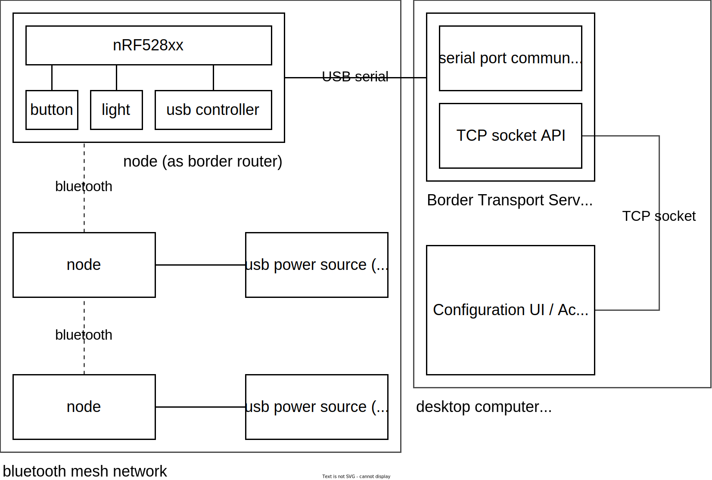

# project domotica

still WIP

## architecture

  

Above is a draft version of the system architecture.

- Each node runs the same firmware, and is capable of being a border router
  over the serial interface exposed by the J-Link debugger.
- A node can turn into a border router, but will still keep functioning as a
  normal node as well.
- The configuration UI can do the following:
  - Change which buttons toggle which led(s)
  - Manually set/reset leds of nodes
  - List all connected nodes in the bluetooth mesh network
- The protocol used for communicating between network nodes is preferably in a
  binary format to save on bandwidth.

